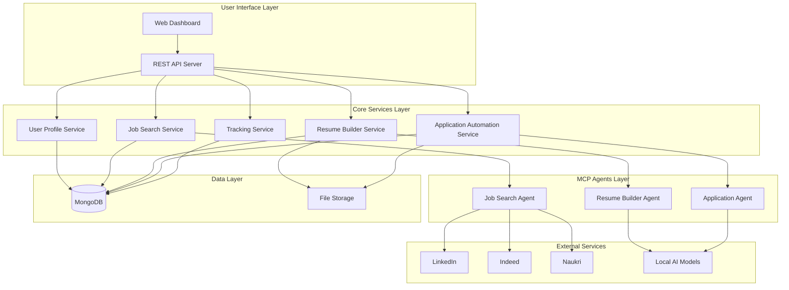

# Design Document

## Overview

The Job Application Automation Platform is a privacy-focused, locally-hosted system that automates the entire job application process. The platform uses a microservices architecture with MCP (Model Context Protocol) agents for automation tasks, a local MongoDB database for data persistence, and a web-based dashboard for user interaction and monitoring.

## Architecture

### High-Level Architecture



### Technology Stack

- **Backend**: Python with FastAPI for high-performance async API server
- **Database**: MongoDB with Motor async driver for structured data storage
- **File Storage**: Local filesystem for resumes and documents
- **Frontend**: React.js with TypeScript for the web dashboard
- **Automation**: Playwright for Python for browser automation
- **AI/ML**: Ollama for local AI model hosting (resume optimization)
- **MCP Framework**: Python MCP SDK for agent coordination and communication
- **Queue System**: Celery with Redis broker for distributed job processing

## Components and Interfaces

### 1. User Profile System

**Purpose**: Manages user registration, profile data, and preferences.

**Key Components**:
- User registration and authentication
- Profile data management (personal info, skills, experience)
- Resume parsing and storage
- Job preference configuration

**Interfaces**:
```python
from pydantic import BaseModel
from typing import List, Optional
from datetime import datetime
from enum import Enum

class WorkType(str, Enum):
    REMOTE = "remote"
    HYBRID = "hybrid"
    ONSITE = "onsite"
    ANY = "any"

class JobPreferences(BaseModel):
    desired_roles: List[str]
    locations: List[str]
    salary_range: dict[str, int]  # {"min": 50000, "max": 100000}
    company_types: List[str]
    work_type: WorkType

class UserProfile(BaseModel):
    id: str
    personal_info: dict
    skills: List[str]
    experience: List[dict]
    preferences: JobPreferences
    resume: dict
    created_at: datetime
    updated_at: datetime
}
```

### 2. Job Search Agent (MCP)

**Purpose**: Continuously searches job portals for relevant opportunities.

**Key Components**:
- Portal-specific scrapers (LinkedIn, Indeed, Naukri)
- Job matching algorithm
- Duplicate detection and filtering
- Search scheduling and queue management

**Interfaces**:
```python
class JobPortal(str, Enum):
    LINKEDIN = "linkedin"
    INDEED = "indeed"
    NAUKRI = "naukri"

class JobListing(BaseModel):
    id: str
    title: str
    company: str
    location: str
    description: str
    requirements: List[str]
    salary: Optional[str] = None
    url: str
    portal: JobPortal
    posted_date: datetime
    match_score: float

class SearchCriteria(BaseModel):
    keywords: List[str]
    location: str
    experience_level: str
    job_type: str
}
```

### 3. Resume Builder Agent (MCP)

**Purpose**: Dynamically tailors resumes for specific job applications using AI.

**Key Components**:
- Job description analysis
- Keyword extraction and optimization
- ATS-friendly formatting
- PDF generation
- Local AI model integration

**Interfaces**:
```python
class ResumeData(BaseModel):
    sections: dict  # Contains summary, experience, skills, education
    formatting: dict  # ATS formatting rules

class ResumeOptimization(BaseModel):
    job_id: str
    original_resume: ResumeData
    job_description: str
    optimized_resume: ResumeData
    keywords_added: List[str]
    optimization_score: float
    generated_at: datetime
}
```

### 4. Application Agent (MCP)

**Purpose**: Automates the job application process using browser automation.

**Key Components**:
- Browser automation with Playwright
- Form field detection and filling
- File upload handling
- Application submission verification
- Error handling and retry logic

**Interfaces**:
```python
class ApplicationStatus(str, Enum):
    PENDING = "pending"
    IN_PROGRESS = "in_progress"
    COMPLETED = "completed"
    FAILED = "failed"

class ApplicationTask(BaseModel):
    id: str
    job_id: str
    user_id: str
    job_url: str
    resume_path: str
    status: ApplicationStatus
    attempts: int
    last_attempt: Optional[datetime] = None
    error_log: Optional[List[str]] = None

class ApplicationResult(BaseModel):
    task_id: str
    success: bool
    submission_id: Optional[str] = None
    error_message: Optional[str] = None
    screenshots: List[str]
    completed_at: datetime
}
```

### 5. Tracking Dashboard

**Purpose**: Provides user interface for monitoring and controlling the automation.

**Key Components**:
- Application status tracking
- Analytics and reporting
- Manual controls for pausing/resuming
- Error logs and notifications
- Data export functionality

**Interfaces**:
```python
class JobApplicationStatus(str, Enum):
    APPLIED = "applied"
    VIEWED = "viewed"
    REJECTED = "rejected"
    INTERVIEW = "interview"
    OFFER = "offer"

class ApplicationStatusRecord(BaseModel):
    id: str
    job_title: str
    company: str
    applied_date: datetime
    status: JobApplicationStatus
    portal: str
    resume_used: str
    notes: Optional[str] = None

class DashboardMetrics(BaseModel):
    total_applications: int
    success_rate: float
    response_rate: float
    average_response_time: float
    top_companies: List[str]
    application_trends: List[dict]  # Time series data
}
```

## Data Models

### Database Schema

```python
from beanie import Document
from pydantic import Field
from typing import Optional

# Users Collection
class User(Document):
    email: str = Field(unique=True)
    password_hash: str
    profile: dict
    settings: dict
    created_at: datetime
    updated_at: datetime
    
    class Settings:
        name = "users"

# Jobs Collection  
class Job(Document):
    external_id: str
    title: str
    company: str
    location: str
    description: str
    requirements: List[str]
    salary: Optional[str] = None
    url: str
    portal: str
    posted_date: datetime
    match_score: float
    status: str  # 'discovered' | 'queued' | 'applied' | 'skipped'
    user_id: str
    created_at: datetime
    
    class Settings:
        name = "jobs"

# Applications Collection
class Application(Document):
    user_id: str
    job_id: str
    resume_id: str
    status: str
    submission_data: dict
    attempts: List[dict]
    created_at: datetime
    updated_at: datetime
    
    class Settings:
        name = "applications"

# Resumes Collection
class Resume(Document):
    user_id: str
    job_id: Optional[str] = None
    type: str  # 'original' | 'optimized'
    content: dict
    file_path: str
    optimization_metadata: Optional[dict] = None
    created_at: datetime
    
    class Settings:
        name = "resumes"
}
```

## Error Handling

### Error Categories

1. **Network Errors**: Portal connectivity issues, rate limiting
2. **Parsing Errors**: Job listing structure changes, form field changes
3. **Authentication Errors**: Portal login failures, session expiration
4. **File System Errors**: Resume generation failures, storage issues
5. **AI Model Errors**: Local model unavailability, processing failures

### Error Handling Strategy

```python
class ErrorCategory(str, Enum):
    NETWORK = "network"
    PARSING = "parsing"
    AUTHENTICATION = "authentication"
    FILE_SYSTEM = "file_system"
    AI_MODEL = "ai_model"

class RetryStrategy(BaseModel):
    max_attempts: int
    backoff_multiplier: float
    initial_delay: float
    max_delay: float

class ErrorHandler(BaseModel):
    category: ErrorCategory
    retry_strategy: RetryStrategy
    fallback_action: str
    user_notification: str
}
```

### Graceful Degradation

- **Job Search Failures**: Continue with available portals, notify user of unavailable sources
- **Resume Optimization Failures**: Use original resume with warning notification
- **Application Failures**: Queue for manual review, provide detailed error logs
- **AI Model Unavailability**: Fall back to template-based resume optimization

## Testing Strategy

### Unit Testing
- Service layer business logic
- Data model validation
- Utility functions and helpers
- MCP agent core functionality

### Integration Testing
- Database operations and queries
- File system operations
- AI model integration
- MCP agent communication

### End-to-End Testing
- Complete job application workflow
- User registration and profile setup
- Dashboard functionality and data display
- Error scenarios and recovery

### Browser Automation Testing
- Portal-specific form filling scenarios
- File upload verification
- Application submission confirmation
- Error handling for changed portal interfaces

### Performance Testing
- Concurrent job search operations
- Large-scale application processing
- Database query optimization
- Memory usage during AI processing

### Security Testing
- Data encryption at rest
- Secure credential storage
- Input validation and sanitization
- File upload security

## Deployment and Configuration

### Local Development Setup
```bash
# Create Python virtual environment
python -m venv venv
source venv/bin/activate  # On Windows: venv\Scripts\activate

# Install Python dependencies
pip install -r requirements.txt

# Start MongoDB
docker-compose up -d mongodb

# Start Redis for Celery
docker-compose up -d redis

# Install and start Ollama for AI models
ollama serve
ollama pull llama2  # or preferred model

# Start development servers
uvicorn main:app --reload --port 8000  # FastAPI backend
npm run dev                            # React frontend
celery -A app.celery worker --loglevel=info  # Celery worker
python -m app.mcp_server              # MCP agent server
```

### Production Configuration
- Environment-based configuration management
- Secure credential storage using environment variables
- Automated backup strategies for MongoDB
- Log rotation and monitoring setup
- Health check endpoints for all services

### Scalability Considerations
- Horizontal scaling of MCP agents
- Database indexing for performance
- Caching strategies for job listings
- Queue management for high-volume processing
- Resource monit